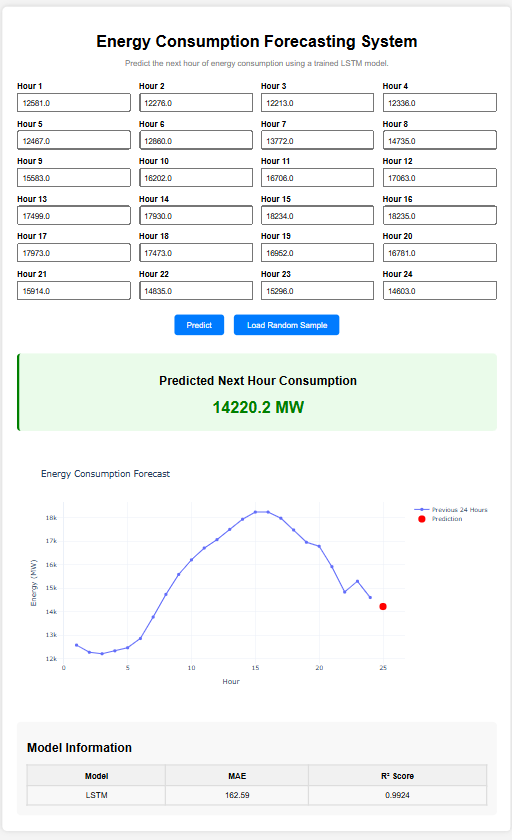

# Energy Consumption Forecasting System

A Machine Learning and Deep Learning based web application that predicts the **next hour's electricity consumption** using historical energy usage data from the **PJM Hourly Energy Consumption Dataset**.

The project demonstrates an end-to-end Machine Learning workflow including data preprocessing, feature engineering, model training, model comparison, deployment using Flask, and interactive visualization using Plotly.

---

## Project Overview

Energy consumption forecasting plays an important role in modern smart grids and power management systems. Accurate forecasting helps utility providers optimize electricity generation, reduce operational costs, and improve resource planning.

This project predicts the next hour's electricity demand by learning patterns from the previous 24 hours of energy consumption.

---

## Features

* Historical energy consumption analysis
* Data preprocessing and feature engineering
* Multiple forecasting models

  * Linear Regression
  * Random Forest
  * XGBoost
  * LSTM (Final Model)
* Flask REST API backend
* React dashboard frontend
* CSV upload only (no manual data entry) — drag & drop or browse
* **Runtime model selection** — choose LSTM, Random Forest, XGBoost, or
  Linear Regression before running a prediction
* Next-hour energy consumption prediction
* SHAP-based explainability (XAI) for every prediction and every model,
  showing how much each input feature contributed to the forecast
* Downloadable sample CSV to test the upload flow

---

## Dataset

**Dataset:** PJM Hourly Energy Consumption Dataset

The dataset contains hourly electricity consumption measurements collected from the PJM Interconnection power grid.

Features used in the project include:

* Hour
* Day
* Month
* Day of Week
* Previous Hour Consumption (Lag Features)
* Previous 24 Hours Consumption (LSTM)

---

## Models Implemented

### 1. Linear Regression

A baseline regression model used to understand the relationship between time-based features and energy consumption.

**Performance**

* MAE: **1822.84**
* R² Score: **0.2397**

---

### 2. Random Forest Regressor

An ensemble learning algorithm capable of capturing nonlinear relationships.

**Performance**

* MAE: **177.19**
* R² Score: **0.9878**

---

### 3. XGBoost Regressor

Gradient Boosting model with improved forecasting accuracy.

**Performance**

* MAE: **174.53**
* R² Score: **0.9912**

---

### 4. LSTM (Final Model)

A Long Short-Term Memory neural network trained using the previous 24 hours of electricity consumption to predict the next hour.

**Performance**

* MAE: **162.59**
* R² Score: **0.9924**

LSTM produced the best forecasting accuracy and was selected as the deployment model.

---

## 🏗️ Project Architecture

```
PJM Dataset
      │
      ▼
Data Preprocessing
      │
      ▼
Feature Engineering
      │
      ▼
Model Training
      │
      ├── Linear Regression
      ├── Random Forest
      ├── XGBoost
      └── LSTM
              │
              ▼
Saved Model (.keras)
              │
              ▼
Flask REST API  ──────────────► SHAP Explainer
   (CSV upload only)                  │
              │                       │
              ▼                       ▼
         Prediction            Per-hour contributions
              │                       │
              └───────────┬───────────┘
                           ▼
                   React Dashboard
              (charts + SHAP explanation)
```

---

## Web Application

The system is now split into a Flask REST API backend and a React
dashboard frontend. Users can:

* Choose which trained model runs the forecast — **LSTM**, **Random
  Forest**, **XGBoost**, or **Linear Regression**
* Upload a CSV file containing hourly energy data (this is the **only**
  way to submit data — there is no manual entry form)
* Download a ready-made sample CSV to try the upload flow
* View the previous 24 hours and the predicted next hour on an
  interactive chart
* View a **SHAP explanation** for whichever model was used — per-hour
  contributions for LSTM, or per-feature contributions (time-of-day and
  lag values) for Random Forest, XGBoost, and Linear Regression

Note: Random Forest, XGBoost, and Linear Regression need to know the
timestamp of the reading they're forecasting for, so CSVs used with
those models must include a `Datetime` (or `Date`/`Timestamp`) column.
LSTM only needs the raw 24-hour value sequence.

---

## Application Preview



---

## Technology Stack

### Programming Language

* Python

### Machine Learning

* Scikit-learn
* XGBoost
* TensorFlow / Keras

### Data Processing

* Pandas
* NumPy

### Visualization

* Matplotlib
* Plotly

### Web Framework

* Flask (REST API)
* Flask-CORS

### Frontend

* React (Vite)
* Recharts

### Explainability (XAI)

* SHAP (KernelExplainer)

---

## 📂 Project Structure

```
EnergyForecastingSystem/

│
├── data/
│      AEP_hourly.csv
│
├── graphs/
│      energy_consumption.png
│      lstm_predictions.png
│      model_comparison.png
│
├── models/
│      random_forest.pkl
│      xgboost.pkl
│      lstm_model.keras
│      lstm_scaler.pkl
│
├── src/
│      app.py                  # Flask REST API (CSV upload + SHAP)
│      linear_regression.py
│      random_forest_model.py
│      xgboost_model.py
│      lstm_model.py
│
├── frontend/                  # React dashboard (Vite)
│      index.html
│      package.json
│      vite.config.js
│      src/
│          App.jsx
│          api.js
│          components/
│              Header.jsx
│              CsvUploader.jsx
│              MetricsPanel.jsx
│              ForecastChart.jsx
│              ShapExplanation.jsx
│
├── screenshots/
│      home_page.png
│
├── requirements.txt
│
└── README.md
```
## Note

Trained model files are included in this delivered project so it runs
out of the box. The `models/` directory is still git-ignored (see
`.gitignore`), since committing binary model files bloats a git
repository — if you push this project to GitHub, the models won't be
included in the commit.

To regenerate any model, run its training script:

1. `linear_regression.py` (now also saves `models/linear_regression.pkl`)
2. `random_forest_model.py`
3. `xgboost_model.py`
4. `lstm_model.py`

The generated models will be stored inside the `models/` directory.

---

## Installation

Clone the repository

```bash
git clone https://github.com/your-username/EnergyForecastingSystem.git
```

Move into the project

```bash
cd EnergyForecastingSystem
```

### 1. Backend (Flask API)

Install the required libraries

```bash
pip install -r requirements.txt
```

Run the API

```bash
cd src
python app.py
```

The API runs at `http://127.0.0.1:5000`. Key endpoints:

| Method | Endpoint           | Description                                   |
| ------ | ------------------ | ---------------------------------------------- |
| GET    | `/api/health`       | Health check                                   |
| GET    | `/api/models`       | List available models and their metrics       |
| GET    | `/api/metrics`      | Metrics for a given model (`?model=xgboost`)   |
| GET    | `/api/sample-csv`   | Downloads a valid sample CSV to test uploads   |
| POST   | `/api/predict`      | Upload a CSV (`file`) + `model` id → prediction + SHAP |

### 2. Frontend (React dashboard)

In a separate terminal:

```bash
cd frontend
npm install
npm run dev
```

Open your browser

```
http://localhost:5173
```

The dev server proxies `/api/*` requests to the Flask backend on port
5000, so make sure the backend is running first.

---

## 📈 Results

Among all implemented models, the LSTM network achieved the highest forecasting accuracy.

| Model             |        MAE |   R² Score |
| ----------------- | ---------: | ---------: |
| Linear Regression |    2011.59 |     0.0506 |
| XGBoost           |     174.53 |     0.9912 |
| Random Forest     |     182.34 |     0.9902 |
| LSTM              | **162.59** | **0.9924** |

---

## 🔮 Future Improvements

* Multi-step energy forecasting
* Weather data integration
* Real-time API support
* Smart Grid dashboard
* Cloud deployment
* User authentication
* Historical prediction storage

---

##  Author

**Ankita Kakade**

Computer Science Engineering (Artificial Intelligence)

Passionate about Machine Learning, Deep Learning, Data Science, and Generative AI.
