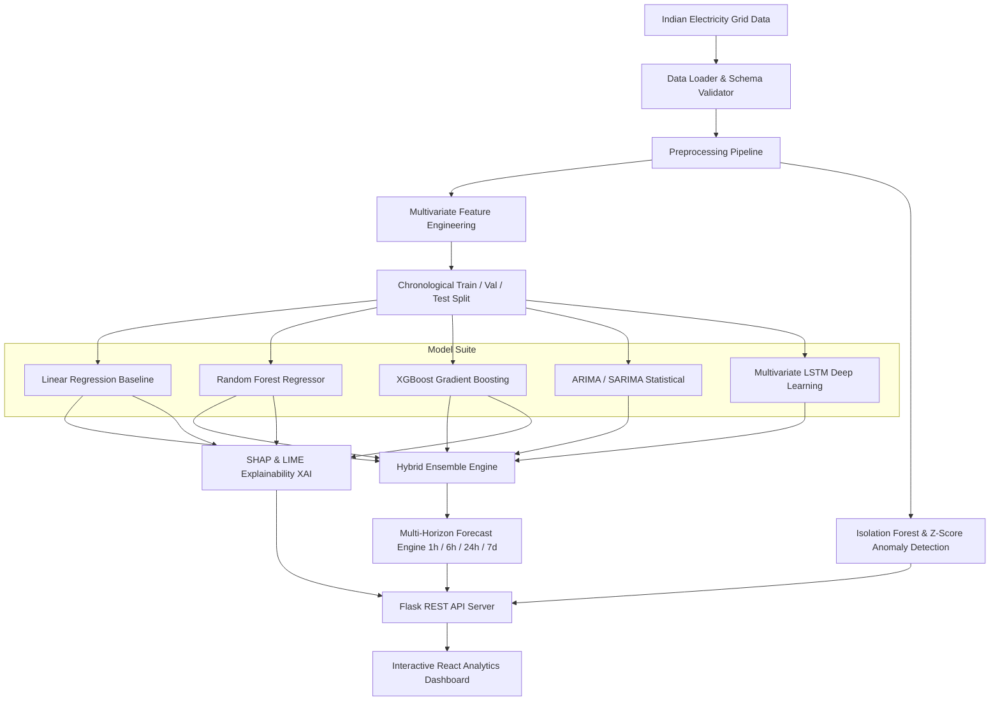
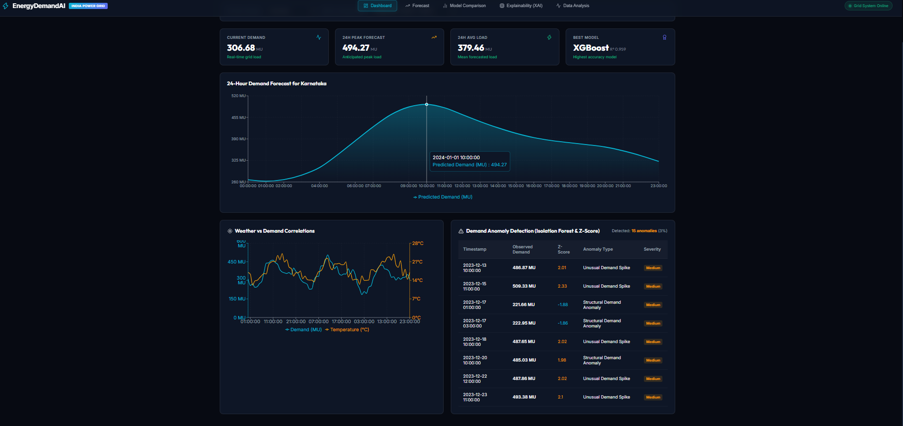
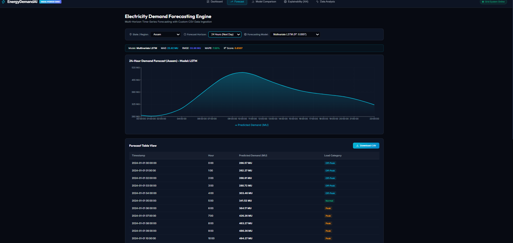
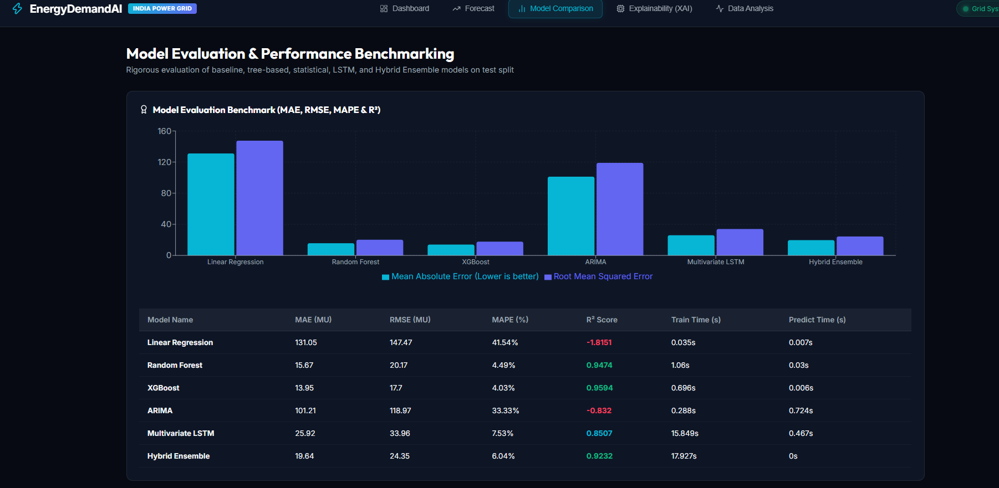

# EnergyDemandAI: AI-Powered Indian Electricity Demand Forecasting & Explainable Decision-Support System

[](https://www.python.org/)
[](https://flask.palletsprojects.com/)
[](https://react.dev/)
[](LICENSE)

**EnergyDemandAI** is a research-oriented, production-ready AI platform designed for **Indian Electricity Demand Forecasting and Explainable Decision Support**. It supports regional and state power grid data across India (Northern, Western, Southern, Eastern, North-Eastern regions), weather indicators (Temperature, Humidity, Rainfall), renewable generation (Solar, Wind, Hydro), Indian calendar metadata (National holidays and festivals), and multi-horizon time-series forecasting.

---

## 🏗️ System Architecture



---

## ✨ Key System Capabilities

1. **Indian Power Grid Schema**: Built for Indian states and regions (`Energy Required (MU)` / `Demand (MW)`), solar/wind/hydro generation profiles, weather variables, and Indian holidays (Diwali, Holi, Independence Day, Republic Day).
2. **Multivariate Feature Engineering**:
   - **Temporal Features**: Hour, Day, Day of Week, Week of Year, Month, Quarter, Weekend indicators.
   - **Cyclic Transformations**: Sin/Cos encoding for hours, days, and months.
   - **Lag Features**: Lags 1, 2, 3, 6, 12, 24, 48, 72, 168 hours.
   - **Rolling Statistics**: 3h, 6h, 12h, 24h, 168h rolling means, standard deviations, min/max bounds.
3. **Multi-Model Intelligence**:
   - **Linear Regression**: Baseline calendar-feature model.
   - **Random Forest**: Multivariate ensemble tree regressor.
   - **XGBoost**: Gradient-boosted decision tree algorithm.
   - **ARIMA / SARIMA**: Statistical time-series model.
   - **Multivariate LSTM**: Deep sequence-to-sequence neural network.
   - **Hybrid Ensemble**: Inverse-validation-MAE weighted ensemble strategy.
4. **Flexible Forecast Horizons**: 1-hour, 6-hour, 24-hour (next-day), and 7-day (weekly) horizon forecasting.
5. **Explainable AI (XAI)**: SHAP waterfall plots, feature attributions, contribution direction (positive/negative impact), LIME instance insights, and natural language decision summaries.
6. **Grid Anomaly Detection**: Isolation Forest and Z-score thresholding to flag unusual demand spikes, drops, and forecasting error deviations.
7. **Interactive React Dashboard**: Modern dark glassmorphism interface built with React 19, Recharts, Lucide Icons, state/region selectors, model comparison tables, custom CSV uploading, and tabular CSV export.

---

## 🖼️ Application Screenshots & User Interface

### Executive Dashboard


### Multi-Horizon Forecast Engine


### Model Comparison & Benchmarking


### Explainable AI (SHAP & LIME Insights)


### Exploratory Data & Weather Analysis


---

## 📊 Measured Model Evaluation Results

Models evaluated on strict chronological 15% test split (1,289 unseen hourly time steps):

| Model | MAE (MU) | RMSE (MU) | MAPE (%) | R² Score | Training Time (s) | Prediction Time (s) |
|---|---|---|---|---|---|---|
| **XGBoost Regressor** | **13.95** | **17.70** | **4.03%** | **0.9594** | 0.696s | 0.006s |
| **Random Forest** | 15.67 | 20.17 | 4.49% | 0.9474 | 1.060s | 0.030s |
| **Hybrid Ensemble** | 19.64 | 24.35 | 6.04% | 0.9232 | 17.927s | 0.000s |
| **Multivariate LSTM** | 25.92 | 33.96 | 7.53% | 0.8507 | 15.849s | 0.467s |
| **ARIMA** | 101.21 | 118.97 | 33.33% | -0.8320 | 0.288s | 0.724s |
| **Linear Regression** | 131.05 | 147.47 | 41.54% | -1.8151 | 0.035s | 0.007s |

---

## 🚀 Quick Start Guide

### 1. Setup & Train Models
```bash
cd EnergyForecastingSystem

# Install backend dependencies
pip install -r requirements.txt

# Generate Indian sample dataset & train all models
python src/generate_sample_data.py
python -m src.train
```

### 2. Run Backend REST API Server
```bash
python src/app.py
```
*(Backend API will start at `http://localhost:5000`)*

### 3. Run React Frontend Dashboard
```bash
cd frontend

# Install frontend dependencies
npm install

# Start Vite dev server
npm run dev
```
*(Frontend dashboard will start at `http://localhost:5173`)*

### 4. Run Automated Pytest Suite
```bash
python -m pytest tests/ -v
```

---

## 📡 REST API Documentation

| Endpoint | Method | Description |
|---|---|---|
| `/api/health` | GET | System health & loaded models list |
| `/api/models` | GET | List available models & benchmark performance metrics |
| `/api/states` | GET | List supported Indian states |
| `/api/regions` | GET | Get Indian regional power grid mapping |
| `/api/history` | GET | Retrieve historical demand, weather & renewable data |
| `/api/forecast` | GET | Generate multi-step forecast (1h, 6h, 24h, 7d) |
| `/api/model-comparison` | GET | Retrieve comparative model metrics table |
| `/api/explain` | GET | SHAP & LIME feature attributions & insights |
| `/api/anomalies` | GET | Detected demand spikes, drops & Z-score anomalies |
| `/api/sample-csv` | GET | Download sample Indian electricity CSV dataset |
| `/api/predict` | POST | Upload custom CSV file & generate 24h prediction with XAI |

---

## 📁 Repository Structure

```text
EnergyDemandAI/
├── EnergyForecastingSystem/
│   ├── data/
│   │   ├── raw/
│   │   ├── processed/
│   │   └── sample/
│   │       └── indian_electricity_sample.csv
│   ├── models/
│   ├── results/
│   │   └── model_comparison.csv
│   ├── graphs/
│   │   └── model_comparison.png
│   ├── src/
│   │   ├── config.py
│   │   ├── data_loader.py
│   │   ├── preprocessing.py
│   │   ├── feature_engineering.py
│   │   ├── forecasting.py
│   │   ├── train.py
│   │   ├── evaluate.py
│   │   ├── ensemble.py
│   │   ├── explainability.py
│   │   ├── anomaly_detection.py
│   │   ├── app.py
│   │   └── models/
│   │       ├── linear_regression.py
│   │       ├── random_forest.py
│   │       ├── xgboost.py
│   │       ├── arima.py
│   │       └── lstm.py
│   ├── frontend/
│   │   ├── src/
│   │   │   ├── App.jsx
│   │   │   ├── api.js
│   │   │   ├── components/
│   │   │   └── pages/
│   │   └── package.json
│   └── tests/
│       ├── test_preprocessing.py
│       ├── test_features.py
│       ├── test_models.py
│       └── test_api.py
└── README.md
```

---

## 📜 License
Distributed under the MIT License.
